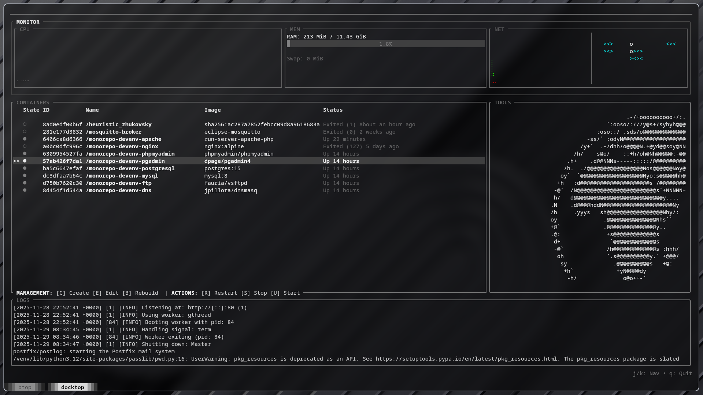

<<<<<<< HEAD
# Monorepo Development Environment

This project provides a Docker-based development environment with multiple services including web servers, databases, and utilities.

## Services Included

- **Nginx**: Frontend proxy server.
- **Apache + PHP 8.2**: Backend web server with PHP support.
- **MySQL**: Relational database server.
- **PostgreSQL**: Relational database server.
- **pgAdmin**: Web-based GUI for managing PostgreSQL.
- **FTP Server (vsftpd)**: FTP service for file transfers.
- **DNS Server (dnsmasq)**: Local DNS for *.localhost domains.

## Prerequisites

- Linux operating system.
- Docker and Docker Compose installed.
- Basic knowledge of terminal commands.

## Installation and Setup on Linux

1. **Install Docker**

   Follow the official Docker installation guide for your Linux distribution:

   https://docs.docker.com/engine/install/

2. **Install Docker Compose**

   Docker Compose V2 is included with recent Docker versions. Verify installation:

   ```bash
   docker compose version
   ```

   If not installed, follow:

   https://docs.docker.com/compose/install/

3. **Clone this repository**

   ```bash
   git clone <repository-url>
   cd monorepo-devenv
   ```

4. **Make the server script executable**

   ```bash
   chmod +x server
   ```

5. **Start the development environment**

   Run the interactive server management script:

   ```bash
   ./server
   ```

   Use arrow keys to navigate the menu and Enter to select options.

## Usage

### Starting and Managing Services

Use the provided `server` script to manage the environment interactively:

```bash
./server
```

This will launch a navigable menu where you can select options such as:

- Start Services
- Stop Services
- Restart Services
- View Logs
- Enter Container
- Check Status
- MySQL Shell
- Clean Up
- Help
- Exit

Navigate using arrow keys and select with Enter.

### Accessing Databases

#### MySQL

- **Port:** 3306
- **Username:** root
- **Password:** root
- **Default Database:** mysqldb

Access MySQL via CLI:

```bash
./server mysql
```

Or manually:

```bash
docker compose exec mysql mysql -u root -p
```

Access MySQL via phpMyAdmin (if running):

- URL: `http://localhost:8080`
- Username: `root`
- Password: `root`

#### PostgreSQL

- **Port:** 5432
- **Username:** root
- **Password:** root
- **Default Database:** postgresdb

Access PostgreSQL via CLI:

```bash
docker compose exec postgresql psql -U root -d postgresdb
```

Or enter container:

```bash
./server enter postgresql
psql -U root -d postgresdb
```

Access PostgreSQL via pgAdmin:

- URL: `http://localhost:5050`
- Email: `admin@admin.com`
- Password: `root`

Add a new server in pgAdmin with the following details:

- Host: `postgresql`
- Port: `5432`
- Username: `root`
- Password: `root`
- Database: `postgresdb`

## Cleaning Up

To stop and remove containers, volumes, and orphan containers:

```bash
./server clean
```

## License

This project is licensed under the MIT License. See the [LICENSE.md](LICENSE.md) file for details.
=======
# DockTop 🐳

<div align="center">



**A beautiful, interactive TUI (Terminal User Interface) for Docker container management**

[](LICENSE)
[](https://www.rust-lang.org/)
[](https://www.docker.com/)

</div>

---


DockTop is a modern, feature-rich terminal user interface for managing Docker containers. Built with Rust and Ratatui, it provides real-time monitoring, interactive wizards, and a beautiful interface inspired by btop.

### ✨ Key Features

- 🎨 **Beautiful UI** - Btop-inspired design with customizable themes
- 📊 **Real-time Monitoring** - Live CPU, memory, and network statistics
- 🔄 **Container Management** - Start, stop, restart, and remove containers
- 🐠 **Animated Background** - Relaxing fish tank animation
- 🌍 **ASCII Globe** - Rotating Earth animation in the tools sidebar
- 🧙 **Interactive Wizards** - Step-by-step guides for:
  - Quick Pull & Run containers
  - Build from Dockerfile
  - Docker Compose generation
- 📝 **Live Logs** - Real-time container log streaming
- 🎯 **Resource Allocation** - Smart resource management for databases
- 🎨 **Theme Support** - Load custom btop-style themes

---

## 🚀 Installation

### Prerequisites

- **Docker** - Required for container management
- **Rust** (optional) - Will be installed automatically if missing

### Quick Install

Clone the repository and run the installation script:

```bash
git clone https://github.com/yourusername/docktop.git
cd docktop
chmod +x install.sh
./install.sh
```

The installation script will:

1. ✅ Check for Rust and install it if needed
2. ✅ Check for Docker (warns if missing)
3. ✅ Build the project in release mode
4. ✅ Install the binary to `/usr/local/bin/docktop`

### Manual Installation

If you prefer to install manually:

```bash
# Build the project
cargo build --release

# Copy the binary to your PATH
sudo cp target/release/docktop /usr/local/bin/docktop

# Or install to user directory
cp target/release/docktop ~/.cargo/bin/docktop
```

---

## 🎮 Usage

Simply run `docktop` from anywhere in your terminal:

```bash
docktop
```

### Keyboard Shortcuts

#### Navigation

- `↑/↓` or `j/k` - Navigate containers
- `Tab` - Switch between sections
- `q` or `Ctrl+C` - Quit application

#### Container Actions

- `Enter` - View container details
- `s` - Start container
- `t` - Stop container
- `r` - Restart container
- `d` - Remove container
- `l` - View logs

#### Tools & Wizards

- `?` - Open wizard menu
- `Esc` - Cancel/Go back
- `Enter` - Confirm selection

---

## ⚙️ Configuration

### Theme Customization

DockTop supports btop-style themes. Create or modify theme files in the `themes/` directory:

```bash
themes/
├── monochrome.theme
├── default.theme
└── custom.theme
```

#### Theme File Format

```ini
# Theme colors
theme[main_bg]="#00"
theme[main_fg]="#cc"
theme[title]="#ee"
theme[hi_fg]="#90"
theme[selected_bg]="#7e2626"
theme[selected_fg]="#ee"
theme[inactive_fg]="#40"
theme[proc_misc]="#0de6e6"
theme[cpu_box]="#3d7b46"
theme[mem_box]="#8a2be2"
theme[net_box]="#e62020"
theme[proc_box]="#3d7b46"
theme[div_line]="#30"
theme[temp_start]="#4897d4"
theme[temp_mid]="#5474e8"
theme[temp_end]="#ff40b6"
theme[cpu_start]="#4897d4"
theme[cpu_mid]="#5474e8"
theme[cpu_end]="#ff40b6"
theme[free_start]="#744daa"
theme[free_mid]="#e65696"
theme[free_end]="#ff40b6"
theme[cached_start]="#00e6e6"
theme[cached_mid]="#00e6e6"
theme[cached_end]="#00e6e6"
theme[available_start]="#00e6e6"
theme[available_mid]="#00e6e6"
theme[available_end]="#00e6e6"
theme[used_start]="#00e6e6"
theme[used_mid]="#00e6e6"
theme[used_end]="#00e6e6"
theme[download_start]="#00e6e6"
theme[download_mid]="#00e6e6"
theme[download_end]="#00e6e6"
theme[upload_start]="#00e6e6"
theme[upload_mid]="#00e6e6"
theme[upload_end]="#00e6e6"
theme[process_start]="#00e6e6"
theme[process_mid]="#00e6e6"
theme[process_end]="#00e6e6"
```

### Configuration File

DockTop looks for configuration in `~/.config/docktop/config.toml`:

```toml
# DockTop Configuration
theme = "monochrome"
refresh_rate = 1000  # milliseconds
```

---

## 🧙 Wizards & Tools

### Quick Pull & Run

Quickly pull and run containers from Docker Hub:

1. Press `?` to open the wizard menu
2. Select "Quick Pull & Run"
3. Enter image name (e.g., `nginx:latest`)
4. Configure ports, environment variables, and resources
5. Press Enter to launch

### Build from Dockerfile

Build and run from local Dockerfile:

1. Press `?` to open the wizard menu
2. Select "Build from Source"
3. Browse to your project directory
4. DockTop will auto-detect the framework (Node.js, Python, Go, etc.)
5. Configure build settings and run

### Docker Compose Generator

Generate production-ready docker-compose.yml files:

1. Press `?` to open the wizard menu
2. Select "Docker Compose"
3. Choose your services (databases, caches, etc.)
4. DockTop automatically calculates optimal resource allocation
5. Review and save the generated compose file

---

## 🎨 Features in Detail

### Real-time Monitoring

- **CPU Usage** - Per-container CPU utilization with history graphs
- **Memory** - RAM usage with detailed breakdowns
- **Network** - RX/TX bandwidth monitoring
- **Disk I/O** - Read/write statistics

### Container Details

View comprehensive information about each container:

- Container ID and Name
- Image and Tag
- Status and Uptime
- Port Mappings
- Environment Variables
- Volume Mounts
- Network Configuration

### Log Streaming

Real-time log viewing with:

- Auto-scroll
- Color-coded output
- Search and filter (coming soon)
- Export logs (coming soon)

---

## 🛠️ Development

### Building from Source

```bash
# Clone the repository
git clone https://github.com/yourusername/docktop.git
cd docktop

# Build in debug mode
cargo build

# Run in development
cargo run

# Build optimized release
cargo build --release
```

### Project Structure

```
docktop/
├── src/
│   ├── main.rs          # Entry point
│   ├── app.rs           # Application state and logic
│   ├── ui.rs            # UI rendering
│   ├── docker.rs        # Docker API integration
│   └── theme.rs         # Theme parsing and management
├── assets/
│   └── earthAnimation.bat  # ASCII globe animation
├── themes/              # Theme files
├── install.sh           # Installation script
└── Cargo.toml          # Dependencies
```

### Dependencies

- **tokio** - Async runtime
- **ratatui** - TUI framework
- **crossterm** - Terminal manipulation
- **bollard** - Docker API client
- **serde** - Serialization
- **sysinfo** - System information
- **chrono** - Date/time handling

---

## 🤝 Contributing

Contributions are welcome! Please feel free to submit a Pull Request.

1. Fork the repository
2. Create your feature branch (`git checkout -b feature/AmazingFeature`)
3. Commit your changes (`git commit -m 'Add some AmazingFeature'`)
4. Push to the branch (`git push origin feature/AmazingFeature`)
5. Open a Pull Request

---

## 📝 License

This project is licensed under the MIT License - see the [LICENSE](LICENSE) file for details.

---

## 🙏 Acknowledgments

- Inspired by [btop](https://github.com/aristocratos/btop) for the beautiful design
- Built with [Ratatui](https://github.com/ratatui-org/ratatui)
- Docker integration via [Bollard](https://github.com/fussybeaver/bollard)

---

## 📧 Contact

For questions, suggestions, or issues, please open an issue on GitHub.

---

<div align="center">

**Made with ❤️ and 🦀 Rust**

</div>
>>>>>>> V2
